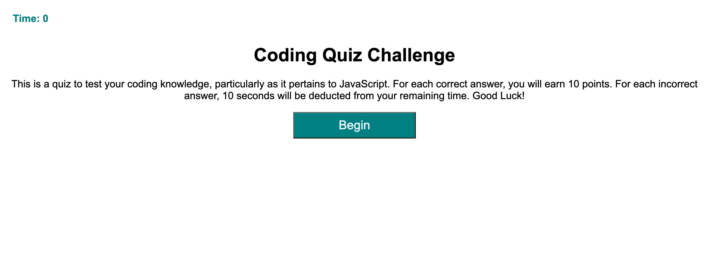

# Coding Quiz

## Purpose
Coding Quiz is an application that allows the user to text their JavaScript knowledge via a short, timed quiz. The quiz consists of 10 questions and the user has 60 seconds to complete it. Each time a question is answered correctly, the user gets 10 points. If the user answers incorrectly, 10 seconds are deducted from the timer. Once the user completes the quiz, they are prompted to enter their initials and their score will be submitted and displayed on a high score leaderboard. 

## Built With:
* JavaScript
* HTML
* CSS

## Website
https://gwarzecha.github.io/coding-quiz/

